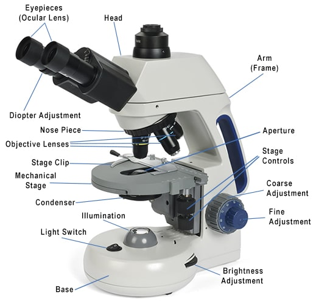

# Documentation

## 显微镜结构

- Class
  - Eyepiece
  - Objective
  - MechanicalStage
  - StageClip
  - Condenser
  - CoarseAdjustment
  - FineAdjustment
  - BrightnessAdjustment
  - Illumination

> *Image from [https://www.microscopeclub.com/parts-of-a-compound-microscope/](https://www.microscopeclub.com/parts-of-a-compound-microscope/)*

## 接口定义

### 文件结构

- meta.xml
  - name
  - description
- resources
  - thumbnail
  - origin
